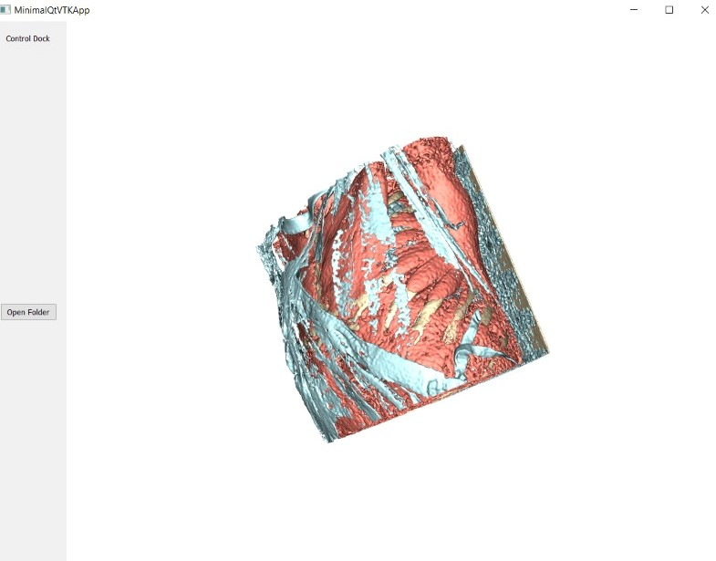
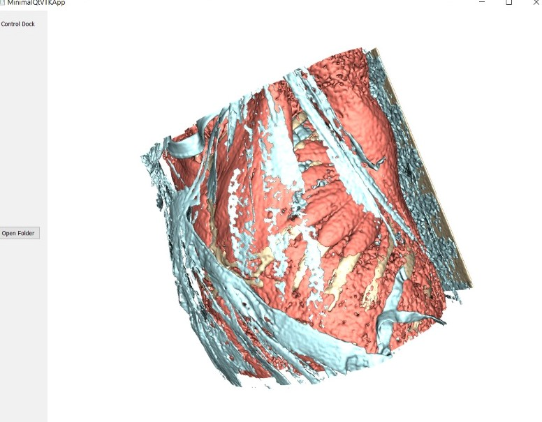

# DICOM_3D_Viewer

The application allows user to open DICOM series and view the 3D shape.

It is based on <a href="https://www.kaggle.com/competitions/osic-pulmonary-fibrosis-progression/data?select=test" target="_blank">OSIC Pulmonary Fibrosis Progression dataset</a>.

### The initial application view:

### Brwosing and opening new DICOM series

### 3D shape Rotation

### 3D shape Zooming

